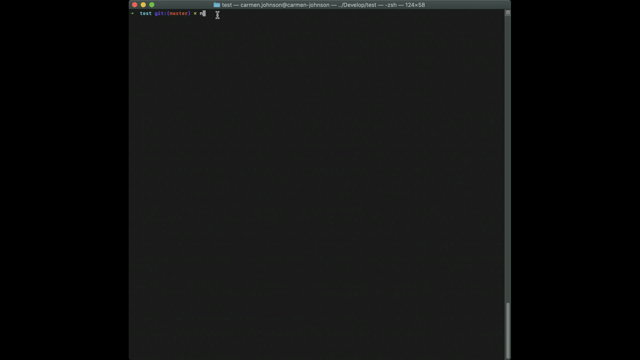
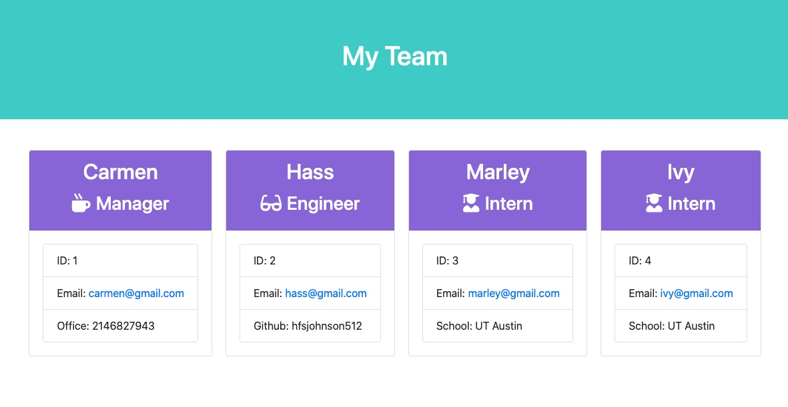

# Carmen Johnson | Employee Summary Template Engine

Email: carmenjohnson512@gmail.com | LinkedIn: https://www.linkedin.com/in/carmenjohnson512/

## Project Overview

A Node CLI that takes in employee information and generates a formatted and styled HTML summary page

## Approach
Breaking down the requirements, I separated out the objective into the following parts:
1. Define a constructor for the Employee class, then extend it into the three employee types: Manager, Engineer, Intern
2. Create html templates for each employee type
3. Using the command line, prompt the Manager to enter their information
4. Once the Manager is added, begin adding team members
5. Using the list of team members, generate the html page containing all members of the team

## App Example

## Test Suite

## Sample Output

